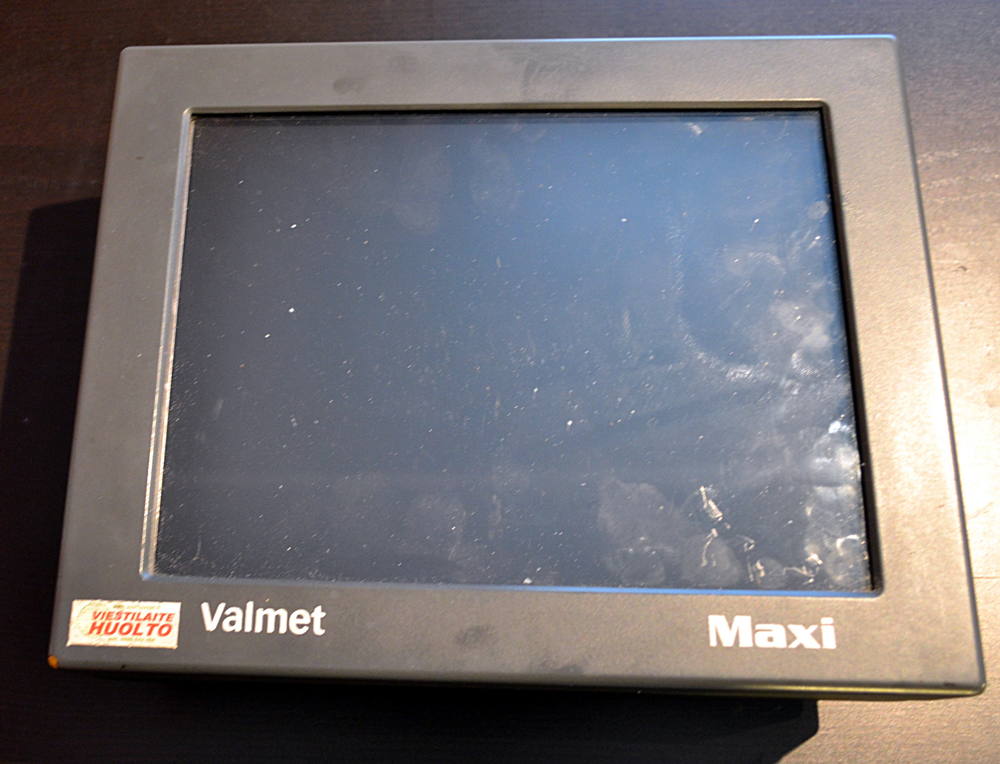
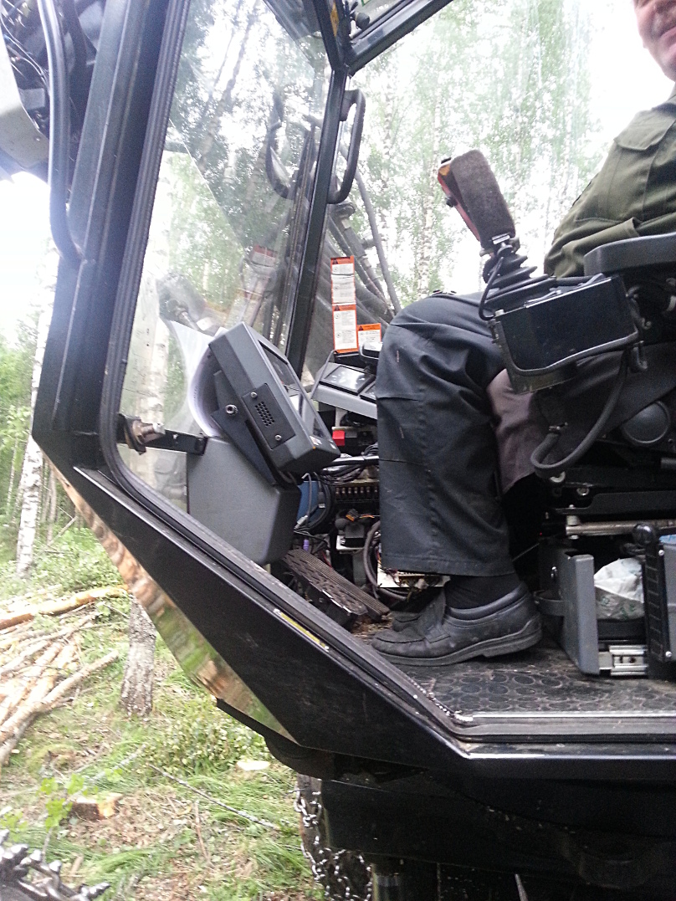

<!-- 00:Kansisivu -->
---
title: Moton ajoneuvotietokoneen päivitysmahdollisuudet uudempaan
author: Tomi Haapaniemi
subject: Moton ajoneuvotietokoneen päivitysmahdollisuudet uudempaan
date: 2015-03-31
company: Metropolia AMK
keywords: moto, sunit, ajoneuvopc
---

\title{Moton ajoneuvotietokoneen päivitysmahdollisuudet uudempaan}
\date{\today}
\author{Tomi Haapaniemi}

\maketitle

\newpage

<!-- 00:EOF --><!-- 02:Johdanto -->

## Lyhenteet

x86: Yleisnimitys Intelin 1987 julkaisemalle CISC-prosessorikäskykannalle. Alkuperäiset 8086/80186/80286 olivat 16-bittisiä, mutta 80386:sta eteenpäin käskykantaa laajennettiin 32-bittiseksi.

PS/2: Sarjaväyläinen, alunperin IBM PS/2 koneessa ollut liitäntäprotokolla, joka yleistyi PC-koneiden standardiliitännäksi näppäimistölle ja hiirelle ennen USB-protokollaa. 5V, GND, data, clock.

RS232: Alunperin v. 1962 esitelty asynkroninen sarjaliitäntäprotokolla, joka oli ennen USB-liitännän yleistymistä yleisin PC-koneiden oheislaitteiden liitäntäväylä.

USB: Universal Serial BUS, vuonna 1996 esitelty sarjaväyläinen liitäntä oheislaitteiden liitäntään.

IDE/PATA:  Integrated Drive Electronics (Parallel AT Attachments), kiintolevyjen ja optisten asemien liittämiseen tarkoitettu 16-bittinen rinnakkainen liitäntäväylä vuodelta 1986.

CAN:  Controller Area Network, vikasietoinen, differentiaalinen kaksijohtoinen automaatioväylä, jossa liikenne lähetetään priorisoituina sanomina vuodelta 1986.

## Johdanto

Tietokoneiden käyttöikä on varsinkin vaativissa kohteissa rajallinen. Kun järjestelmien ikä kasvaa niin varaosien saatavuus vähenee. Viimein ollaan pisteessä, missä ainoa vaihtoehto on korvata vanha järjestelmä uudella. Tämä saattaa vaatia mittavia päivitysprojekteja myös järjestelmää tukeviin kokonaisuuksiin ja vaihdon kannattavuus suhteessa hyötyyn on huono. 

Järjestelmänä on vuonna xxx valmistetun metsätraktori, eli tuttavallisemmin moto. Motolla on n. yy v käyttöikää jäljellä ja moton ajoneuvotietokone, jolla hallitaan koneen moottoriasetuksia, että myös puiden kadon hallintaa, alkaa olemaan elinikänsä loppupäässä. Alkuperäinen tietokone lakkaa toimimasta kokonaan kuumennettuaan liikaa, kiintolevy on hajonnyt useaan otteeseen ja akustot alkavat olemaan uusimisen tarpeessa. Jos laitteiston vaihtaisi kokonaan uudempaan olisi kyseessä sen verran kallis toimenpide(n. 20 000€), ettei sitä kannata tehdä enää kyseiseen metsätraktoriin. Tämän takia tutkimmekin vaihtoehtoisia ratkaisuita lisätä metsätraktorin käytössä olevalle tietokonejärjestelmälle elinikää.

Insinöörityön aiheena on löytää motossa käytetylle 15v vanhan Sunit Nero-ajoneuvotietokoneelle korvaava uudempi, mutta yhteensopiva tietokone. Tavoitteena on uuden laitteen yhteensopivuus vanhan kiinnitysjärjestelmän kanssa, liitinyhteensopivuus, sekä ohjelmallisen tason yhteensopivuus. Aluksi tutustutaan käytössä olevaan laitteistoon ja sen asettamiin vaatimuksiin. Seuraavaksi käydään läpi mahdollisia toteuttamisvaihtoehtoja ja niiden ominaisuuksia. Asennetaan uusi ohjelmisto testikannetavaan ja testataan järjestelmä tuotantoympäristössä. Lopuksi tutkitaan mahdolliset 

Haasteita työlle asettavat vanhat ohjelmistot, tärinää ja pölyä ja vaihtelevia lämpötiloja sisältävä työympäristö. Metsätraktori on huoltoja lukuunottamatta metsässä kesät talvet ja lämpötilat vaihtelevat talvella -20 asteesta +20 asteeseen ja kesäisin lämmöt voivat nousta ohjaamossa jopa +50-60 asteeseen.

<!-- 02:EOF --><!-- 03:Taustaa !-->

# Taustaa

## Hakkuukoneet
Hakkuukoneet eli motot (monitoimikoneet) ovat metsätraktoreita, joiden tehtävänä on hakkuun kaikki työvaiheet. Hakkuukoneet sisältävät tietokoneistetu mittalaitteet joilla katkonta ja mittaus saadaan hoidettua tarkasti.

### Hakkuukone Valmet xxx
Lorem ipsum dolor sit amet, consectetur adipiscing elit. Nam sed gravida ex. Sed leo nisl, viverra in efficitur eget, imperdiet vel nibh. Donec gravida sapien facilisis nisl rhoncus, sit amet ullamcorper nulla congue. Donec egestas nisi sed finibus tempus. Integer convallis suscipit magna et sollicitudin. Fusce gravida nisl eros, sit amet congue odio aliquam vel. Vivamus congue massa eget est efficitur, dapibus lacinia velit porttitor. Nunc consectetur sit amet augue vel ultrices. Nullam hendrerit nisi efficitur tincidunt molestie.

### Motomit-mittalaite
Kohteena olevaan Valmet xxx-hakkuukoneeseen on jälkiasennettu Motomit-IT -mittalaite, joka on korvannut hakkuukoneen alkuperäiset mittalaitteet ja ohjelmiston hakkuussa. Motomit IT tukee StanForD-standardin mukaista apteerausohjeiden tiedonsiirtoa. Motomit IT hoitaa sisäisen kommunikaation CAN-väylää pitkin. Kommunikaatiossa alkuperäisen ajoneuvotietokoneen kanssa käytetään RS232-väylää ja MotomitPC -ohjelmistoa. [@motomit_kaytto-ohje]

#### Kuva: Motomit kaavio {#Motomit_kaavio}
{#Motomit_kaavio width=100%}
Caption: Motomit IT:n moduulikaavio

## Ajoneuvo-PC Sunit Nero / Valmet Maxi
#### Figure: Sunit Nero {#Nero}
{#Nero width=100%}
Hakkuukoneessa kiinni oleva ajoneuvo-PC Sunit Nero / Valmet Maxi on valmistettu [joskus 1997-1999]. Sunit Nero on oikeastaan kannettava, johon on modifioitu ulkopuoliset liittimet ja tukevampi runko. Kotelointi koostuu XXX-muovisista ulkokuorista, sekä metallilevystä (teräs? alumiini?), jonka molemmin puolin on komponentit kiinnitetty. Toisella puolen on emolevy,prosessori,NIMH-akku (asetusten säilytystä varten? ymmärtääkseni) ja liittimet, toisella puolen kiintolevy, levykeasema,cd-asema ja näyttö. Näyttöpaneeli on 4:3 800x60 LCD.

Ajoneuvotietokoneeessa on ollut koko käyttöiän (~15v) erilaisia ongelmia. Alkuperäinen laite on vaihdettu syystä x vuonna y. Nykyisestä laitteesta on kiintolevy hajonnut vuonna xxxx ja 2014, jolloin pääsin ensimmäisen kerran tutustumaan laitteeseen paremmin. Prosessori on vaihdettu v. zzzz.

#### Figure: AMD K6 {#AMDK6}
{#AMDK6 width=50%}
Caption: AMD K6 66 MHz

Koneen ongelmana on ollut viime aikoina ylikuumeneminen. Kuumennettuaan siitä tulee epävakaa eikä se lähde päälle ennekuin jäähdyttyään, joka kuumana kesäpäivänä traktorin hytissä vie aikaa

## Alkuperäinen järjestelmä
Lorem ipsum dolor sit amet, consectetur adipiscing elit. Proin tempus vehicula aliquam. Morbi vulputate in lacus at convallis. Phasellus a urna odio. Sed varius luctus imperdiet. Sed quis mollis nulla, non posuere ipsum. Nunc elementum leo at ante molestie, sed fringilla nunc luctus. Curabitur cursus mollis turpis eu ultrices. Nam id massa sodales, congue ligula nec, scelerisque quam. Nunc ullamcorper massa volutpat nibh rutrum, et convallis felis faucibus. Nunc vitae dolor sed justo viverra malesuada. Duis luctus, lacus at bibendum varius, neque mi feugiat quam, eget faucibus sapien tortor eget diam. Donec id libero dapibus, interdum eros ac, euismod purus. Nam tincidunt at augue quis mollis. Phasellus eget viverra neque. Integer felis purus, auctor gravida varius vel, ultrices in risus. Proin nec aliquam nisl.

Ut eleifend tellus sit amet venenatis tincidunt. Quisque mattis interdum augue, suscipit porta turpis cursus at. Sed suscipit ac urna eget pretium. Suspendisse nisl justo, placerat vel urna et, luctus rutrum arcu. Praesent maximus fringilla ante, ac vulputate urna dictum vel. Sed non neque quis massa feugiat lacinia. Fusce eu mi posuere, volutpat tortor ac, fermentum nulla. Sed id malesuada eros. Nulla eros est, hendrerit in hendrerit sed, ultricies ac sem. Aliquam vel congue turpis. Aenean viverra sagittis dolor vitae dapibus. Aenean ac tincidunt metus. Curabitur in aliquet sem. Vestibulum ante ipsum primis in faucibus orci luctus et ultrices posuere cubilia Curae;

## Standardeja

### EU-direktiivi 2004/104/EY
Direktiivi 2004/104/EY (Autoteollisuuden EMC-direktiivi) määrittää, että 1.7.2006 alkaen valmistettujen ajoneuvojen ja kiinteiästi asennetun ajoneuvoelektroniikan aiheuttamat säteilypäästöt ja päästöjen sietokyky mitataan kyseisen direktiivin mukaisesti. Direktiiviin on julkaistu lisäys 2005/83/EY, joka tarkentaa direktiiviä. Uusi direktiivi korvaan aiemman direktiivin 95/54/EY.

Uusi direktiivi vaatii tyyppihyväksynnän vain laitteilta, joilla on vaikutusta ajoneuvon hallintaan, kuljettajan asennon muuttamiseen tai kuljettajan näkyvyysalueeseen. Laitteiden, joiden ei tarvitse olla tyyppihyväksyttyjä, pitää täyttää kuitenkin EMC-direktiivin 89/336/ETY tai radio- ja telepäätelaitedirektiivin 1999/5/EY vaatimukset. [@ajoneuvodirektiivi1] [@1999/5/EY] [@89/336/ETY]

### EMC-direktiivi 89/336/ETY ja 2004/108/EY 
EMC-direktiivi 89/336/ETY määrittelee ainoastaan laitteistolta vaadittavat ominaisuudet sähkömagneettisen yhteensopivuuden takaamiseksi. Direktiivin tarkoitus on ohjeistaa valmistajia tekemään elektromagneettisesti yhteensopivia laitteita. Direktiivi koskee kaikkia sähkölaitteita ja -asennuksia, joita ei direktiivissä ole erikseen rajattu sen ulkopuolelle [@89/336/ETY]. Direktiivi 2004/108/EY kumosi vanhemman direktiivin 89/336/ETY 20.7.2004 alkaen. 2004/108/EY mm. erotteli kiinteille asennuksille ja laitteille tehtävät asennukset, sekä yksinkertaisti vaatimustenmukaisuuden arviointimenettelyä. [@2004/108/EY]

### Radio- ja telepäätelaitedirektiivi 1999/5/EY
Radio- ja telepäätelaitedirektiivi 1999/5/EY määrittää radio ja telepäätelaitteiden yhteensopivuuden euroopan laajuisesti. Kaikkiin direktiivin piiriin kuuluvien laitteiden tulee olla turvallisia käyttäjälle ja muille henkilöille, sekä täyttää vaaditut suojavaatimukset sähkömagneettisen yhteensopivuuden osalta. Lisäksi direktiivi määrittää että laitteistojen tulee olla rakennettuja siten että ne käyttävät tehokaasti radioviestintään varattua spektriä ja resursseja. Tietyille laiteluokille on lisäksi määritelty vielä muita vaadittuja lisäominaisuuksia, kuten yksityisyyden suojan takaamisen, yhteensopivuuden muiden laitteistojen välillä, sisältävät petoksia ehkäiseviä ominaisuuksia, tukevat hätäpalveluihin pääsyn takaavia ominaisuuksia ja/tai sisältävät ominaisuuksia joilla laitteistojen käyttö tehdään helpommaksi vammaisille [@1999/5/EY]. Direktiivi 1999/5/EY on kumottu 13.6.2016 alkaen direktiivillä 2014/53/EU radiolaitteiden asettamista saataville markkinoilla koskevan jäsenvaltioiden lainsäädännön yhdenmukaistamisesta. [@2014/53/EU]

### IP-suojaluokitus
IP-suojaluokitus on standardissa  IEC 60529 määritetty järjestelmä sähkölaitteiden tiiveyden määrittämiseksi. IP-luokitus kertoo laitteiden suojauksen pölyä ja vettä vastaan. [@IEC60529]

#### IP54
IP54-suojaluokitetut tuotteet ovat pölysuojattuja (ei täydellistä tiiveyttä, mutta ei pölykertymiä), sekä roiskesuojattuja.

#### IP67/66
IP67/66 -suojaluokitetut tuotteet ovat täysin pölytiiviitä ja kestävät suurella paineella tulevan vesiruiskun. IP67/66-tuotteet kestävät tärinää ja iskuja 5M3-vaatimusten mukaisesti. (DIN EN 60721-3-5, MIL-STD 810F.)

<!-- 03:EOF !--><!-- 04:Suunnittelu !-->

# Tutustuminen alkuperäiseen järjestelmään

### Huolto 05-06/2014
Huoltaessani konetta 05-06/2014 vaihdoin kiintolevyn, sekä uudet lämpötahnat prosessorille. Kiintolevyn vaihdon takia emolevy piti irroittaa kiinnitysruuvien sijainnin takia ja samalla myös prosessorijäähy. Vanhat jäähdytyslevyn lämpötahnat olivat kuivaneet ja vaihdoin tilalle hopeatahnaa jota löytyi varastostani. Kiintolevyn hankin käytettynä Huuto.netistä koska uusien toimitusajat olivat viikkoja, hinnat ~100€ eikä kiintolevyn koolla ollut väliä koska kyseessä on minimaallinen ohjelmien ja tilantarve. 

Kone kiinnitettiin takaisin motoon 1.7.2014 ja säädettyä portit kuntoon MotomitPC:stä ja Termanista, järjestelmä vaikutti toimivan ja poistuin paikalta.
#### Figure: Moto {#Moto1}
{#Moto1 width=25%}
{#Moto2 width=25%}

### Huolto xx/2014
Vaihdettu, käytettynä ostettu kiintolevy oli hajonnut käytössä ja se korvattiin SD-muistikorttipohjaisella ratkaisulla.

### Huolto 03/2015
Koneen BIOS-asetuksia ylläpitävä akusto (NIMH 10,8V) hajosi ja tietokoneen hukattua asetukset se ei enää suostunut käynnistymään normaalisti. Akku vaihdettiin/uudelleenkennotettiin, ja SD-muistikortilla oleva käyttöjärjestelmä+ohjelmisto varmuuskopioitiin. 

Maecenas at faucibus libero, ut consequat felis. Curabitur blandit arcu at velit mattis, at sagittis felis egestas. Integer massa lacus, efficitur a blandit eget, imperdiet a velit. Curabitur viverra elit quis mauris tincidunt ornare. Cum sociis natoque penatibus et magnis dis parturient montes, nascetur ridiculus mus. Pellentesque pharetra, orci eu commodo mattis, tellus nisi tristique lectus, id pellentesque nisi risus eu nisi. Morbi aliquam neque a lectus tincidunt euismod a sagittis dui. Pellentesque eu dapibus dui, eget porttitor risus. Aliquam porttitor laoreet libero sed elementum. Phasellus blandit eget ipsum sit amet consequat. Nulla ut nisl mollis nunc dapibus malesuada sit amet suscipit erat. Curabitur lobortis eget mauris in condimentum. Donec finibus, odio sit amet condimentum condimentum, mauris nulla egestas nulla, vel aliquet felis odio nec orci. Sed dapibus feugiat nisi, sit amet maximus velit iaculis ac.

#Suunnittelu

##Toteuttamisvaihtoehdot
### Natiivi ympäristö
Vaihtoehdossa tietokoneeseen asennettaan uusin käyttöjärjestelmä, mitä käytössä oleva laitteisto ja ohjelmat tukevat. Vaihtoehto on haasteellinen, koska ohjelmistot ovat vanhoja ja laitteisto uutta. Uusien laitteiden tuki vanhoilla käyttöjärjestelmillä on puutteellinen tai puuttuva.

### Ohjelmistojen rajapintojen yhteensopivuuskerros
Vaihtoehdossa käytetään käyttöjärjestelmän ja ohjelman välissä sopivia rajapintakerroksia, jolloin saadaan käyttöjärjestelmän kanssa yhteensopimattomat ohjelmat toimimaan keskenään. Vaihtoehto vaatii yhteensopivan laitteistoarkkitehtuurin alkuperäisen järjestelmän kanssa. Nykyiset Windows-versiot (Windows XP+) sisältävät jo valmiiksi yhteensopivuustilan, joka mahdollistaa vanhempien ohjelmien käyttämisen uudemmissa käyttöjärjestelmissä. Linuxissa Wine-rajapintatoteutus mahdollistaa kaikenikäisten Windows-sovellusten ajamisen Linuxissa.

### Virtualisointi
Vaihtoehdossa alkuperäisiä ohjelmistoja+käyttöjärjestelmää ajetaan virtuaalikoneessa toisen käyttöjärjestelmän päällä. Näin saavutetaan varmin yhteensopivuus ohjelmistotasolla. Oheislaitteiden siirtämisessä virtualisoidun koneen käyttöön on rajoituksia, jotka pitää huomioida virtualisointiohjelmistoja valittaessa. Vaihtoehto kuluttaa muistia enemmän ja on hieman hitaampi kuin natiivi toteutus, hyötysuhteen ollessa ~90% natiivista [@virtnat_anadtech].

### Järjestelmäemulointi
Vaihtoehdossa alkuperäisiä ohjelmistoja+käyttöjärjestelmä ajetaan emulaattorissa toisen järjestelmän päällä. Emuloimalla saavutetaan laitteistoarkkitehtuuririippumattomuus isäntäkoneen ja emuloitavan järjestelmän välillä. Emuloinnin haittapuolena on hitaus. Nyrkkisääntönä on 20% hyötysuhde [@tinycc], parhaat emulaattorit pääsevät n. 40% hyötysuhteeseen [@40pperf]

### Ohjelmistojen emulointi
Vaihtoehdossa emuloidaan vain ohjelmat koko pc:n sijasta. Tämä onnistuu tietyillä ohjelmilla tiettyjen ohjelmistoarkkitehtuurien välillä [@qemu_use],[@tinycc]. Vaihtoehdolla voi ajaa x86-ohjelmia ARM-prosessoreilla.

### Valinta
X86: Lorem ipsum dolor sit amet, consectetur adipiscing elit. Nunc vestibulum magna dui, quis vestibulum libero molestie vel. Phasellus dui risus, vehicula sit amet tincidunt nec, rutrum at erat. Aenean ex dolor, luctus sit amet scelerisque vel, euismod vel urna. Morbi accumsan, odio at tincidunt cursus, nibh quam consectetur turpis, at ultrices erat lorem tristique libero. Fusce aliquet lectus sit amet sodales convallis. Proin tempor libero eu accumsan bibendum. Proin ullamcorper tempor eros, blandit pellentesque eros ornare vel. Nulla ac ultricies nisi. Phasellus ligula lectus, ullamcorper in libero sit amet, pretium pretium dolor. Nunc euismod mollis nibh, at rhoncus dolor volutpat blandit. Nam ipsum felis, tempus ut justo ut, fringilla tincidunt augue. Vivamus non finibus turpis, at consectetur justo.

Pellentesque ullamcorper odio at arcu venenatis consequat vel at sem. Nulla sed scelerisque justo. Nunc consequat sem nunc, a maximus mi ultrices non. Nunc posuere eu sapien a laoreet. Quisque sit amet mi congue, tempus libero ut, viverra velit. Donec aliquam, metus non rhoncus ullamcorper, magna quam pharetra lectus, in dapibus sapien sapien quis purus. Maecenas convallis luctus semper. Nunc non ex nec est faucibus faucibus ac eget dui. Phasellus ligula urna, lacinia in metus nec, bibendum lobortis leo. Nunc dictum urna tortor, nec viverra dolor suscipit et. Pellentesque vel hendrerit elit, eu pharetra quam. Cras fringilla ullamcorper massa, quis porta justo. Praesent cursus, elit nec finibus convallis, felis lorem luctus nulla, ut pulvinar tellus quam feugiat turpis. Donec hendrerit massa eu ornare scelerisque. Cras non elit vitae risus scelerisque mollis. Pellentesque vehicula sapien nec felis eleifend blandit sit amet eu magna.

<!-- 04:EOF !--><!-- 05:Toteutus !-->

# Toteutus

Projektissa päädyttiin käyttämään käyttöjärjestelmänä Linux-distribuutiota Xubuntu 14.04. Alkuperäiset ohjelmistot Motomit PC ja Terman sovitettiin käyttöön Wine-rajapinnan ja Dosbox/Dosemu DOS-emulaattorin avulla. Järjestelmä asennettiin testausta varten vanhaan Fujitsu-Siemensin kannettavaan. Johtuen rankoista olosuhteita, tavallista kannettavaa käytetään vain käyttöjärjestelmän ja ohjelmien testaamiseksi yhdessä Moton kanssa.

## Tarvittavat asennukset
Perusasennuksella asennettavaan Xubuntu-käyttöjärjestelmään tarvitsee lisäksi asentaa seuraavat paketit, että alkuperäiset ohjelmistot saadaan toimimaan:
* Dosbox DOS-emulaattori Termania varten
* Wine -rajapinta Motomit PC:tä varten. MotomitPC tuli päivittää uusimpaan versioon, jotta ohjelmisto toimisi winen alla.

### Xubuntu
Käyttöjärjestelmäksi valittiin Xubuntusta pitkän tuen versio 14.04. Xubuntu asennettiin oletusasetuksilla testikoneeseen. Lisäksi Xubuntu laitettiin kirjautumaan sisään automaattisesti, sekä Dosbox ja MotomitPC laitettiin käynnistymään automaattisesti sisäänkirjautumisen yhteydessä.

Käytetylle USB-sarjaporttiadapterille lisättiin oma udev-sääntö, jonka ansiosta adapterin kaksi sarjaporttia tulevat näkyviin Linuxissa samoilla laitetiedosto (Device file)-nimillä. (ref:udev-sääntö)

###Wine
Wine on Windows-yhteensopivuuskerros Unixin kaltaisiin (mm. Unix/Linux/OS X/Solaris) käyttöjärjestelmiin, joka mahdollistaa Windows-ohjelmien käyttämisen käytetyssä käyttöjärjestelmässä. Vaikka Motomit sisältääkin taustajärjestelmänään Linuxin[ref:Motomit-manuaali], niin käyttöliittymäänä tomivasta MotomitPC -ohjelmasta on vain olemassa Windows-versio.

Jotta sarjaportit saa toimimaan Windowsin käyttämillä COM-porttinimillä Windows-ohjelmien puolella, tulee laitetiedostoista tehdä symboliset linkit ~/.wine/dosdevices/ -hakemistoon halutuilla nimillä (COM1 ja COM2).[ref Wine-manuaali]

###Dosbox
Dosbox on DOS-emulaattori, joka emuloi IBM PC-yhteensopivaa tietokonetta 286/386-prosessorilla, sekä monia kyseisen aikakauden laitteistoja. Dosbox sisältää lisäksi suoratuen sarjaportille, niin se on valittu käytettäväksi DOS-emulaattoriksi.

Koska Dosbox on emulaattori, niin siinä pystyy säätämään suoritusnopeutta, ruudun resoluutiota/kokoa, yms. varsin monipuolisesti. Asetin suoritusnopeuden maksimiin, ruudun koon ikkunamoodissa kokoon 800x600 ilman näppäinlukitusta, sekä poistin ääniemulaation käytöstä. Dosboxissa sarjaportit määritetään samasta asennustiedostosta kuin muutkin asetukset, joten sinne piti lisätä vähintään Termanin käyttämä sarjaportti käyttöön. (asetustiedosto liitteenä)[ref:http://www.dosbox.com/wiki/Dosbox.conf]

<!-- 05:EOF !--><!-- 10:Yhteenveto !-->

# Yhteenveto

Tämän työn tarkoitus oli selvittää mahdolliseuudet päivittää Moto-traktorin 20v vanha ajoneuvotietokone uudemaksi tarpeen tullessa. Testikoneella tehdyissä testeissä alkuperäiset ohjelmistot saatiin toimimaan uudemmissa käyttöjärjestelmissä, sekä testattua että ne toimivat myös tuotantoympäristössä (toivottavasti). Näiden tulosten perusteella voidaankin todeta, että alkuperäinen ajoneuvotietokone voidaan tarpeen tullen korvata uudemmalla ajoneuvoympäristöön tarkoitetulla laitteella kunhan uudesta laitteesta löytyy tarvittavat liittimet (vaihtoehtoisesti vähintään 2 sarjaporttiliitäntää tai USB-liitäntä). Nämä vaatimukset täyttyvät todennäköisesti suurimmalla osalla tarjolla olevista vaihtoehdoista. Korvaamalla vain laitteistopuoli ja pitämällä ohjelmat alkuperäisinä säästytään kalliilta (ja kannattamattomalta) vaihdostyöltä, jossa kaikki kyseissen metsätraktorin elektroniikka olisi vaihdettu uudelle ohjaukselle.

Ehdotan uudeksi laitteistoksi jotain ajoneuvokäyttöön/"rugged laptopia", jonka saisi kiinnitetty suht. helposti vanhan laitteen tilalle. Esimerkiksi kääntyvänäyttöinen Panasonic Toughbook CF-19 tai vastaavat voisivat olla sopivia vaihtoehtoja, tai uusi Sunit-ajoneuvotietokone.

Lorem ipsum dolor sit amet, consectetur adipiscing elit. Nullam tincidunt, neque et laoreet porttitor, diam quam luctus velit, quis congue felis massa eu sem. Curabitur convallis tincidunt ex, vel cursus ipsum viverra id. Quisque lacus nisi, luctus luctus placerat vel, ullamcorper sit amet justo. Sed id mi purus. Nulla faucibus nec nisl id scelerisque. In hac habitasse platea dictumst. Sed bibendum ac nunc id malesuada. Phasellus nec quam placerat, finibus urna ut, placerat massa. Curabitur scelerisque nisi diam, ut semper sem aliquet ultricies. Pellentesque dignissim lorem scelerisque, tempus sem at, luctus dui.

Integer in pretium elit. Phasellus id sapien porttitor, ornare lectus a, porta arcu. Quisque tellus nisi, imperdiet in mauris a, tempor convallis elit. Pellentesque interdum semper augue vitae tempus. Maecenas elit tellus, imperdiet quis tempus varius, rutrum et justo. Duis tincidunt id velit eu vehicula. Sed mattis neque eu pellentesque hendrerit. Aliquam gravida tortor in ante egestas, vel gravida tortor blandit. Sed a scelerisque dolor. Suspendisse maximus urna in justo dapibus posuere.

<!-- 10_EOF !-->