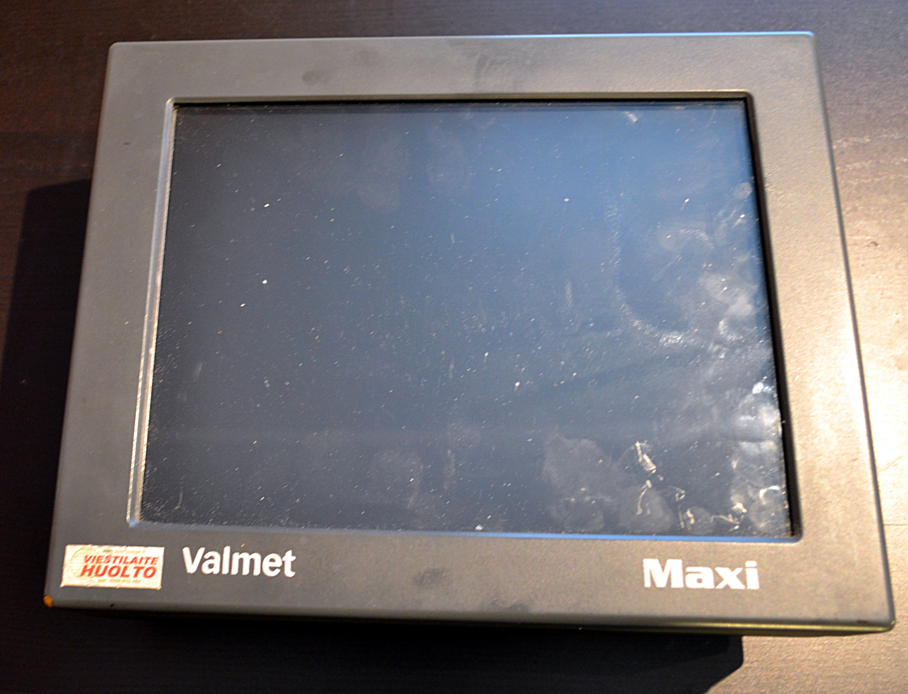
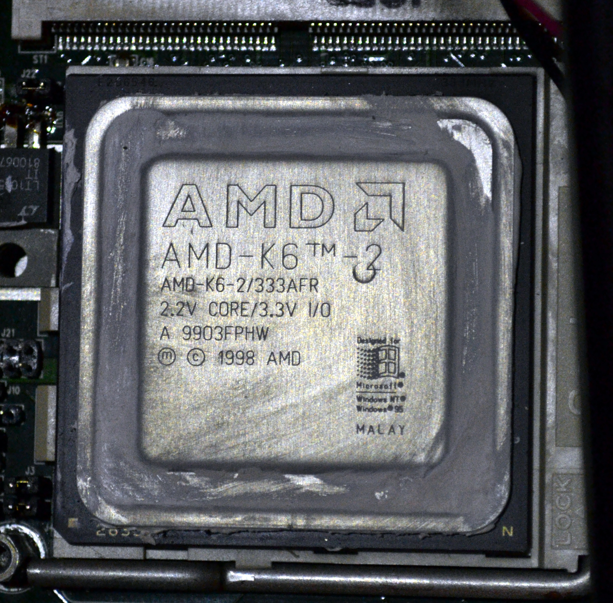

<!-- 03:Taustaa !-->

# Taustaa

## Metsätraktori Valmet xxx
Lorem ipsum dolor sit amet, consectetur adipiscing elit. Nam sed gravida ex. Sed leo nisl, viverra in efficitur eget, imperdiet vel nibh. Donec gravida sapien facilisis nisl rhoncus, sit amet ullamcorper nulla congue. Donec egestas nisi sed finibus tempus. Integer convallis suscipit magna et sollicitudin. Fusce gravida nisl eros, sit amet congue odio aliquam vel. Vivamus congue massa eget est efficitur, dapibus lacinia velit porttitor. Nunc consectetur sit amet augue vel ultrices. Nullam hendrerit nisi efficitur tincidunt molestie.

Vivamus pulvinar facilisis tortor nec faucibus. Praesent nec nisl nunc. Vestibulum vestibulum luctus felis, ut sodales sapien sagittis sed. Sed pellentesque sed leo vitae aliquet. Vestibulum accumsan ipsum sed leo luctus, eget euismod tortor egestas. Mauris iaculis libero eu rutrum maximus. Aenean dignissim convallis quam consequat congue.

Nulla tincidunt augue in lobortis porta. Pellentesque sit amet laoreet sem. Lorem ipsum dolor sit amet, consectetur adipiscing elit. Cras congue iaculis erat. Vestibulum eros mi, vestibulum vel accumsan fermentum, posuere nec mauris. Ut sem arcu, malesuada quis urna ac, bibendum tempor dolor. Vestibulum fringilla eros sit amet massa maximus varius non vitae elit. Sed condimentum et eros nec tincidunt. Sed massa erat, malesuada id odio vel, elementum vehicula erat. Donec nec mi et ex dignissim luctus non at nulla.

## Ajoneuvo-PC Sunit Nero / Valmet Maxi
#### Figure: Sunit Nero {#Nero}
{#Nero width=25%}
Traktorissa kiinni oleva ajoneuvo-PC Sunit Nero / Valmet Maxi on valmistettu [joskus 1997-1999]. Sunit Nero on oikeastaan kannettava, johon on modifioitu ulkopuoliset liittimet ja tukevampi runko. Kotelointi koostuu XXX-muovisista ulkokuorista, sekä metallilevystä (teräs? alumiini?), jonka molemmin puolin on komponentit kiinnitetty. Toisella puolen on emolevy,prosessori,NIMH-akku (asetusten säilytystä varten? ymmärtääkseni) ja liittimet, toisella puolen kiintolevy, levykeasema,cd-asema ja näyttö. Näyttöpaneeli on 4:3 800x60 LCD.

Koska kyseessä on kuitenkin kiinteäksi tarkoitettu paketti, niin laitteelta löytyy painoa xxx,xx kg.

PC:ssä on ollut koko käyttöiän (~15v) erilaisia ongelmia. Alkuperäinen laite on vaihdettu syystä x vuonna y. Nykyisestä laitteesta on kiintolevy hajonnut vuonna xxxx ja 2014, jolloin pääsin ensimmäisen kerran tutustumaan laitteeseen paremmin. Prosessori on vaihdettu v. zzzz.

#### Figure: AMD K6 {#AMDK6}
{#AMDK6 width=25%}
Caption: AMD K6 66 MHz

Koneen ongelmana on ollut viime aikoina ylikuumeneminen. Kuumennettuaan siitä tulee epävakaa eikä se lähde päälle ennekuin jäähdyttyään, joka kuumana kesäpäivänä traktorin hytissä vie aikaa

## Alkuperäinen järjestelmä
Lorem ipsum dolor sit amet, consectetur adipiscing elit. Proin tempus vehicula aliquam. Morbi vulputate in lacus at convallis. Phasellus a urna odio. Sed varius luctus imperdiet. Sed quis mollis nulla, non posuere ipsum. Nunc elementum leo at ante molestie, sed fringilla nunc luctus. Curabitur cursus mollis turpis eu ultrices. Nam id massa sodales, congue ligula nec, scelerisque quam. Nunc ullamcorper massa volutpat nibh rutrum, et convallis felis faucibus. Nunc vitae dolor sed justo viverra malesuada. Duis luctus, lacus at bibendum varius, neque mi feugiat quam, eget faucibus sapien tortor eget diam. Donec id libero dapibus, interdum eros ac, euismod purus. Nam tincidunt at augue quis mollis. Phasellus eget viverra neque. Integer felis purus, auctor gravida varius vel, ultrices in risus. Proin nec aliquam nisl.

Ut eleifend tellus sit amet venenatis tincidunt. Quisque mattis interdum augue, suscipit porta turpis cursus at. Sed suscipit ac urna eget pretium. Suspendisse nisl justo, placerat vel urna et, luctus rutrum arcu. Praesent maximus fringilla ante, ac vulputate urna dictum vel. Sed non neque quis massa feugiat lacinia. Fusce eu mi posuere, volutpat tortor ac, fermentum nulla. Sed id malesuada eros. Nulla eros est, hendrerit in hendrerit sed, ultricies ac sem. Aliquam vel congue turpis. Aenean viverra sagittis dolor vitae dapibus. Aenean ac tincidunt metus. Curabitur in aliquet sem. Vestibulum ante ipsum primis in faucibus orci luctus et ultrices posuere cubilia Curae;

## Standardeja

### EU-direktiivi 2004/104/EY
Direktiivi 2004/104/EY (Autoteollisuuden EMC-direktiivi) määrittää, että 1.7.2006 alkaen valmistettujen ajoneuvojen ja kiinteiästi asennetun ajoneuvoelektroniikan aiheuttamat säteilypäästöt ja päästöjen sietokyky mitataan kyseisen direktiivin mukaisesti. Direktiiviin on julkaistu lisäys 2005/83/EY, joka tarkentaa direktiiviä. Uusi direktiivi korvaan aiemman direktiivin 95/54/EY.

Uusi direktiivi vaatii tyyppihyväksynnän vain laitteilta, joilla on vaikutusta ajoneuvon hallintaan, kuljettajan asennon muuttamiseen tai kuljettajan näkyvyysalueeseen. Laitteiden, joiden ei tarvitse olla tyyppihyväksyttyjä, pitää täyttää kuitenkin EMC-direktiivin 89/336/ETY tai radio- ja telepäätelaitedirektiivin 1999/5/EY vaatimukset. [@ajoneuvodirektiivi1] [@1999/5/EY] [@89/336/ETY]

### EMC-direktiivi 89/336/ETY ja 2004/108/EY 
EMC-direktiivi 89/336/ETY määrittelee ainoastaan laitteistolta vaadittavat ominaisuudet sähkömagneettisen yhteensopivuuden takaamiseksi. Direktiivin tarkoitus on ohjeistaa valmistajia tekemään elektromagneettisesti yhteensopivia laitteita. Direktiivi koskee kaikkia sähkölaitteita ja -asennuksia, joita ei direktiivissä ole erikseen rajattu sen ulkopuolelle [@89/336/ETY]. Direktiivi 2004/108/EY kumosi vanhemman direktiivin 89/336/ETY 20.7.2004 alkaen. 2004/108/EY mm. erotteli kiinteille asennuksille ja laitteille tehtävät asennukset, sekä yksinkertaisti vaatimustenmukaisuuden arviointimenettelyä. [@2004/108/EY]

### Radio- ja telepäätelaitedirektiivi 1999/5/EY
Radio- ja telepäätelaitedirektiivi 1999/5/EY määrittää radio ja telepäätelaitteiden yhteensopivuuden euroopan laajuisesti. Kaikkiin direktiivin piiriin kuuluvien laitteiden tulee olla turvallisia käyttäjälle ja muille henkilöille, sekä täyttää vaaditut suojavaatimukset sähkömagneettisen yhteensopivuuden osalta. Lisäksi direktiivi määrittää että laitteistojen tulee olla rakennettuja siten että ne käyttävät tehokaasti radioviestintään varattua spektriä ja resursseja. Tietyille laiteluokille on lisäksi määritelty vielä muita vaadittuja lisäominaisuuksia, kuten yksityisyyden suojan takaamisen, yhteensopivuuden muiden laitteistojen välillä, sisältävät petoksia ehkäiseviä ominaisuuksia, tukevat hätäpalveluihin pääsyn takaavia ominaisuuksia ja/tai sisältävät ominaisuuksia joilla laitteistojen käyttö tehdään helpommaksi vammaisille [@1999/5/EY]. Direktiivi 1999/5/EY on kumottu 13.6.2016 alkaen direktiivillä 2014/53/EU radiolaitteiden asettamista saataville markkinoilla koskevan jäsenvaltioiden lainsäädännön yhdenmukaistamisesta. [@2014/53/EU]

### IP-suojaluokitus
IP-suojaluokitus on standardissa  IEC 60529 määritetty järjestelmä sähkölaitteiden tiiveyden määrittämiseksi. IP-luokitus kertoo laitteiden suojauksen pölyä ja vettä vastaan. [@IEC60529]

#### IP54
IP54-suojaluokitetut tuotteet ovat pölysuojattuja (ei täydellistä tiiveyttä, mutta ei pölykertymiä), sekä roiskesuojattuja.

#### IP67/66
IP67/66 -suojaluokitetut tuotteet ovat täysin pölytiiviitä ja kestävät suurella paineella tulevan vesiruiskun. IP67/66-tuotteet kestävät tärinää ja iskuja 5M3-vaatimusten mukaisesti. (DIN EN 60721-3-5, MIL-STD 810F.)

<!-- 03:EOF !-->