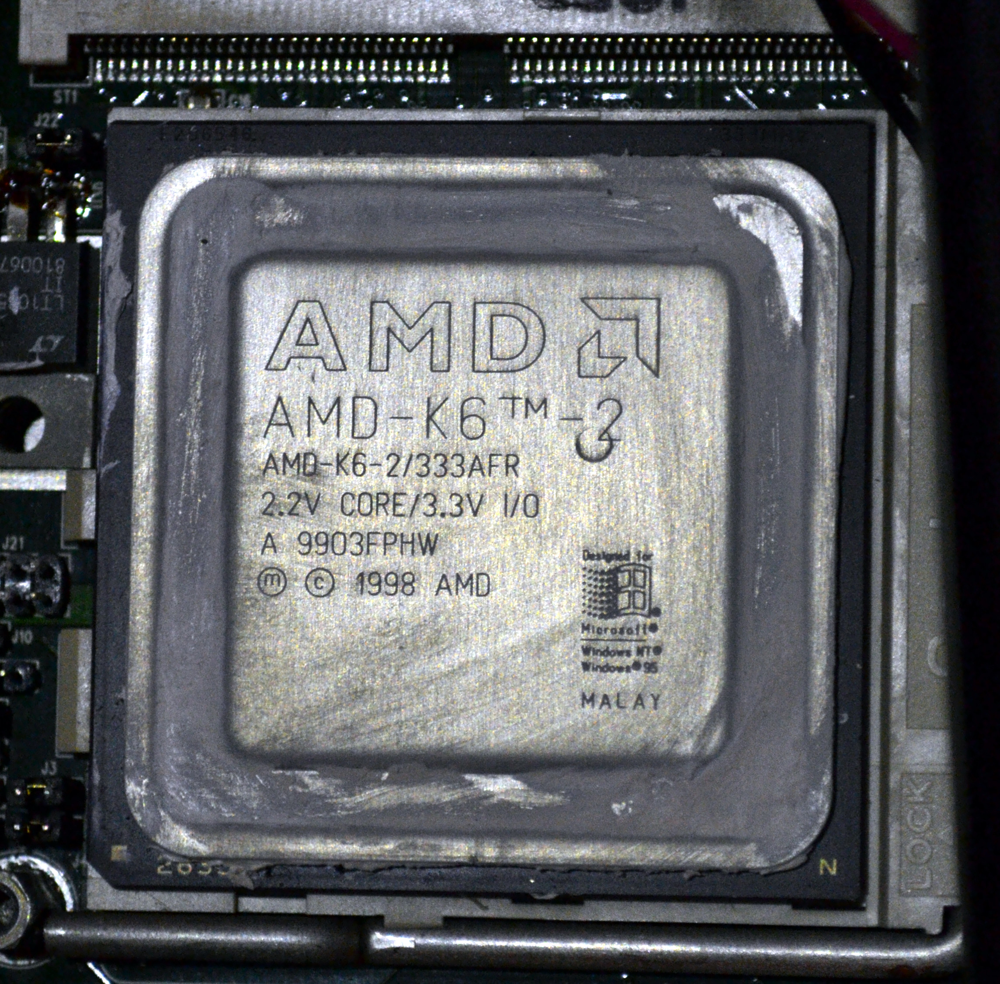

## Alkuperäinen järjestelmä

### Ajoneuvo-PC Sunit Nero

Traktorissa kiinni oleva ajoneuvo-PC Sunit Nero / Valmet Maxi on valmistettu [joskus 1997-1999]. Sunit Nero on oikeastaan kannettava, johon on modifioitu ulkopuoliset liittimet ja tukevampi runko. Kotelointi koostuu XXX-muovisista ulkokuorista, sekä metallilevystä (teräs? alumiini?), jonka molemmin puolin on komponentit kiinnitetty. Toisella puolen on emolevy,prosessori,NIMH-akku (asetusten säilytystä varten? ymmärtääkseni) ja liittimet, toisella puolen kiintolevy, levykeasema,cd-asema ja näyttö. Näyttöpaneeli on 4:3 800x60 LCD.

Koska kyseessä on kuitenkin kiinteäksi tarkoitettu paketti, niin laitteelta löytyy painoa xxx,xx kg.

PC:ssä on ollut koko käyttöiän (~15v) erilaisia ongelmia. Alkuperäinen laite on vaihdettu syystä x vuonna y. Nykyisestä laitteesta on kiintolevy hajonnut vuonna xxxx ja 2014, jolloin pääsin ensimmäisen kerran tutustumaan laitteeseen paremmin. Prosessori on vaihdettu v. zzzz.

#### Figure: AMD K6 {#AMDK6}
{#AMDK6 width=25%}
Caption: AMD K6 66 MHz

Koneen ongelmana on ollut viime aikoina ylikuumeneminen. Kuumennettuaan siitä tulee epävakaa eikä se lähde päälle ennekuin jäähdyttyään, joka kuumana kesäpäivänä traktorin hytissä vie aikaa.

### Huolto 05-06/2014

Huoltaessani konetta 05-06/2014 vaihdoin kiintolevyn, sekä uudet lämpötahnat prosessorille. Kiintolevyn vaihdon takia emolevy piti irroittaa kiinnitysruuvien sijainnin takia ja samalla myös prosessorijäähy. Vanhat jäähdytyslevyn lämpötahnat olivat kuivaneet ja vaihdoin tilalle hopeatahnaa jota löytyi varastostani. Kiintolevyn hankin käytettynä Huuto.netistä koska uusien toimitusajat olivat viikkoja, hinnat ~100€ eikä kiintolevyn koolla ollut väliä koska kyseessä on minimaallinen ohjelmien ja tilantarve. 

Kone kiinnitettiin takaisin motoon 1.7.2014 ja säädettyä portit kuntoon MotomitPC:stä ja Termanista, järjestelmä vaikutti toimivan ja poistuin paikalta.
#### Figure: Moto {#Moto1}
{#Moto1 width=25%}
{#Moto2 width=25%}

### Huolto xx/2014
Vaihdettu, käytettynä ostettu kiintolevy oli hajonnut käytössä ja se korvattiin SD-muistikorttipohjaisella ratkaisulla.

### Huolto 03/2015
SD-muistikorttiratkaisu oli hajonnut. Ratkaisu korvattiin nopeiten saatavissa olleella vaihtoehdolla, CF-muistikorttipohjaisella kiintolevykorvikkeella. Samalla tilattiin varastoon lisää kiintolevyadaptereita ja laitettiin ne käyttövalmiiksi siten, että osan hajottua voi vain vaihtaa uuden tilalle.

