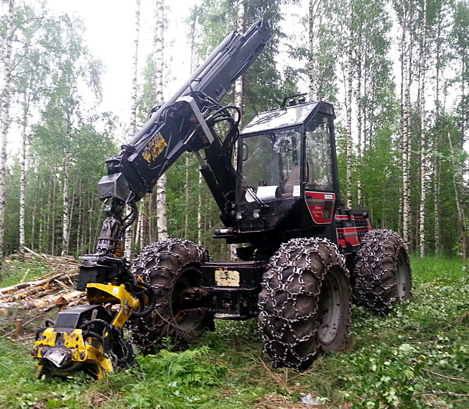

<!-- 04:Suunnittelu !-->

# Tutustuminen alkuperäiseen järjestelmään

### Huolto 05-06/2014
Huoltaessani konetta 05-06/2014 vaihdoin kiintolevyn, sekä uudet lämpötahnat prosessorille. Kiintolevyn vaihdon takia emolevy piti irroittaa kiinnitysruuvien sijainnin takia ja samalla myös prosessorijäähy. Vanhat jäähdytyslevyn lämpötahnat olivat kuivaneet ja vaihdoin tilalle hopeatahnaa jota löytyi varastostani. Kiintolevyn hankin käytettynä Huuto.netistä koska uusien toimitusajat olivat viikkoja, hinnat ~100€ eikä kiintolevyn koolla ollut väliä koska kyseessä on minimaallinen ohjelmien ja tilantarve. 

Kone kiinnitettiin takaisin motoon 1.7.2014 ja säädettyä portit kuntoon MotomitPC:stä ja Termanista, järjestelmä vaikutti toimivan ja poistuin paikalta.
#### Figure: Moto {#Moto1}
{#Moto1 width=25%}
{#Moto2 width=25%}

### Huolto xx/2014
Vaihdettu, käytettynä ostettu kiintolevy oli hajonnut käytössä ja se korvattiin SD-muistikorttipohjaisella ratkaisulla.

### Huolto 03/2015
Koneen BIOS-asetuksia ylläpitävä akusto (NIMH 10,8V) hajosi ja tietokoneen hukattua asetukset se ei enää suostunut käynnistymään normaalisti. Akku vaihdettiin/uudelleenkennotettiin, ja SD-muistikortilla oleva käyttöjärjestelmä+ohjelmisto varmuuskopioitiin. 

Maecenas at faucibus libero, ut consequat felis. Curabitur blandit arcu at velit mattis, at sagittis felis egestas. Integer massa lacus, efficitur a blandit eget, imperdiet a velit. Curabitur viverra elit quis mauris tincidunt ornare. Cum sociis natoque penatibus et magnis dis parturient montes, nascetur ridiculus mus. Pellentesque pharetra, orci eu commodo mattis, tellus nisi tristique lectus, id pellentesque nisi risus eu nisi. Morbi aliquam neque a lectus tincidunt euismod a sagittis dui. Pellentesque eu dapibus dui, eget porttitor risus. Aliquam porttitor laoreet libero sed elementum. Phasellus blandit eget ipsum sit amet consequat. Nulla ut nisl mollis nunc dapibus malesuada sit amet suscipit erat. Curabitur lobortis eget mauris in condimentum. Donec finibus, odio sit amet condimentum condimentum, mauris nulla egestas nulla, vel aliquet felis odio nec orci. Sed dapibus feugiat nisi, sit amet maximus velit iaculis ac.

#Suunnittelu

##Toteuttamisvaihtoehdot
### Natiivi ympäristö
Vaihtoehdossa tietokoneeseen asennettaan uusin käyttöjärjestelmä, mitä käytössä oleva laitteisto ja ohjelmat tukevat. Vaihtoehto on haasteellinen, koska ohjelmistot ovat vanhoja ja laitteisto uutta. Uusien laitteiden tuki vanhoilla käyttöjärjestelmillä on puutteellinen tai puuttuva.

### Ohjelmistojen rajapintojen yhteensopivuuskerros
Vaihtoehdossa käytetään käyttöjärjestelmän ja ohjelman välissä sopivia rajapintakerroksia, jolloin saadaan käyttöjärjestelmän kanssa yhteensopimattomat ohjelmat toimimaan keskenään. Vaihtoehto vaatii yhteensopivan laitteistoarkkitehtuurin alkuperäisen järjestelmän kanssa. Nykyiset Windows-versiot (Windows XP+) sisältävät jo valmiiksi yhteensopivuustilan, joka mahdollistaa vanhempien ohjelmien käyttämisen uudemmissa käyttöjärjestelmissä. Linuxissa Wine-rajapintatoteutus mahdollistaa kaikenikäisten Windows-sovellusten ajamisen Linuxissa.

### Virtualisointi
Vaihtoehdossa alkuperäisiä ohjelmistoja+käyttöjärjestelmää ajetaan virtuaalikoneessa toisen käyttöjärjestelmän päällä. Näin saavutetaan varmin yhteensopivuus ohjelmistotasolla. Oheislaitteiden siirtämisessä virtualisoidun koneen käyttöön on rajoituksia, jotka pitää huomioida virtualisointiohjelmistoja valittaessa. Vaihtoehto kuluttaa muistia enemmän ja on hieman hitaampi kuin natiivi toteutus, hyötysuhteen ollessa ~90% natiivista [@virtnat_anadtech].

### Järjestelmäemulointi
Vaihtoehdossa alkuperäisiä ohjelmistoja+käyttöjärjestelmä ajetaan emulaattorissa toisen järjestelmän päällä. Emuloimalla saavutetaan laitteistoarkkitehtuuririippumattomuus isäntäkoneen ja emuloitavan järjestelmän välillä. Emuloinnin haittapuolena on hitaus. Nyrkkisääntönä on 20% hyötysuhde [@tinycc], parhaat emulaattorit pääsevät n. 40% hyötysuhteeseen [@40pperf]

### Ohjelmistojen emulointi
Vaihtoehdossa emuloidaan vain ohjelmat koko pc:n sijasta. Tämä onnistuu tietyillä ohjelmilla tiettyjen ohjelmistoarkkitehtuurien välillä [@qemu_use],[@tinycc]. Vaihtoehdolla voi ajaa x86-ohjelmia ARM-prosessoreilla.

### Valinta
X86: Lorem ipsum dolor sit amet, consectetur adipiscing elit. Nunc vestibulum magna dui, quis vestibulum libero molestie vel. Phasellus dui risus, vehicula sit amet tincidunt nec, rutrum at erat. Aenean ex dolor, luctus sit amet scelerisque vel, euismod vel urna. Morbi accumsan, odio at tincidunt cursus, nibh quam consectetur turpis, at ultrices erat lorem tristique libero. Fusce aliquet lectus sit amet sodales convallis. Proin tempor libero eu accumsan bibendum. Proin ullamcorper tempor eros, blandit pellentesque eros ornare vel. Nulla ac ultricies nisi. Phasellus ligula lectus, ullamcorper in libero sit amet, pretium pretium dolor. Nunc euismod mollis nibh, at rhoncus dolor volutpat blandit. Nam ipsum felis, tempus ut justo ut, fringilla tincidunt augue. Vivamus non finibus turpis, at consectetur justo.

Pellentesque ullamcorper odio at arcu venenatis consequat vel at sem. Nulla sed scelerisque justo. Nunc consequat sem nunc, a maximus mi ultrices non. Nunc posuere eu sapien a laoreet. Quisque sit amet mi congue, tempus libero ut, viverra velit. Donec aliquam, metus non rhoncus ullamcorper, magna quam pharetra lectus, in dapibus sapien sapien quis purus. Maecenas convallis luctus semper. Nunc non ex nec est faucibus faucibus ac eget dui. Phasellus ligula urna, lacinia in metus nec, bibendum lobortis leo. Nunc dictum urna tortor, nec viverra dolor suscipit et. Pellentesque vel hendrerit elit, eu pharetra quam. Cras fringilla ullamcorper massa, quis porta justo. Praesent cursus, elit nec finibus convallis, felis lorem luctus nulla, ut pulvinar tellus quam feugiat turpis. Donec hendrerit massa eu ornare scelerisque. Cras non elit vitae risus scelerisque mollis. Pellentesque vehicula sapien nec felis eleifend blandit sit amet eu magna.

<!-- 04:EOF !-->